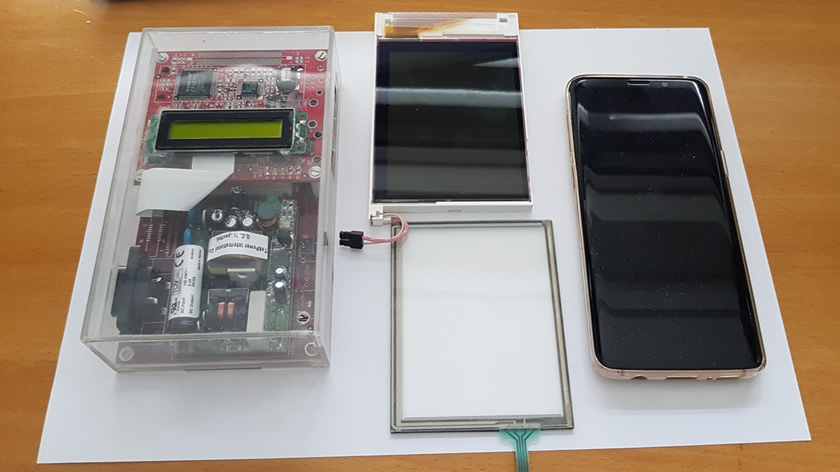

\[Click on the image to view it in a higher resolution\]  
[])(media/cerberus-hcc-2001.jpg)  
\[Cerberus as it was presented at the 2001 edition of the HCC fair\]

# cerberus

### Welcome to the Wonderful World of single board computing

This is a placeholder project containing some introductory images.

## Photo shoot

Cerberus with an LCD in jewel casing as it was presented at the 2001 edition of the CeBit Hannover.
Sadly, the photo is low resolution and the only one existing

\[Click on the image to view it in a higher resolution\]  
](media/lcd-jewelcase-1449x923.jpg)

Left: Cerberus in jewel case  
Center: the revolutionary Toshiba LTM04C380K with 640x480 display.  
Right: Samsung galaxy S9 as comparision.  
Datasheet: [media/LTM04C380Kv10.pdf](media/LTM04C380Kv10.pdf)

\[Click on the image to view it in a higher resolution\]  
](media/daughter-1074x1000.jpg)

Displaying the main/daugherboard bus connector.  
The mainboard contains all the digital components, the extended board the function specific components.  
There were design plans to use radio components making it one of the first smart phones.

## Versioning

This project adheres to [Semantic Versioning](http://semver.org/spec/v2.0.0.html).
For the versions available, see the [tags on this repository](https://github.com/xyzzy/cerberus/tags).

## License

This project is licensed under the GNU General Public License v3 - see the [LICENSE.txt](LICENSE.txt) file for details
