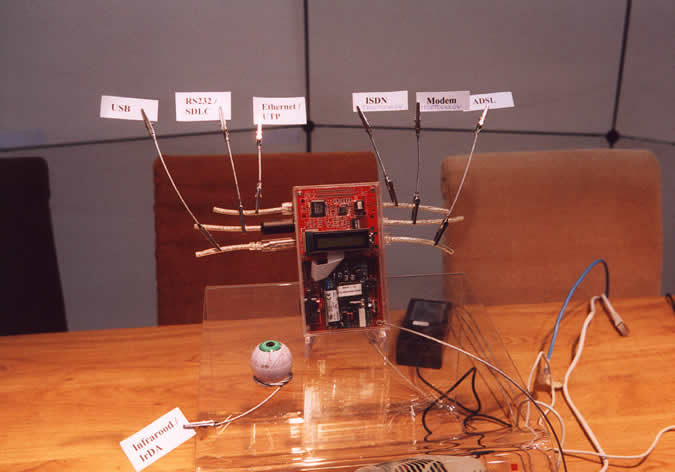

\[Click on the image to view it in a higher resolution\]  
[])(media/cerberus-hcc-2001.jpg)  
\[Cerberus as it was presented at the 2001 edition of the HCC fair\]

# cerberus

### Welcome to the Wonderful World of single board computing

This is a placeholder project containing some introductory images.

## Versioning

This project adheres to [Semantic Versioning](http://semver.org/spec/v2.0.0.html).
For the versions available, see the [tags on this repository](https://github.com/xyzzy/cerberus/tags).

## License

This project is licensed under the GNU General Public License v3 - see the [LICENSE.txt](LICENSE.txt) file for details
