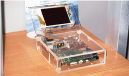
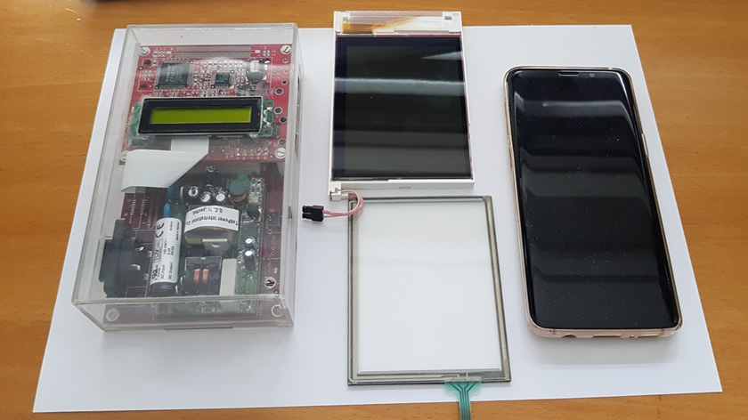
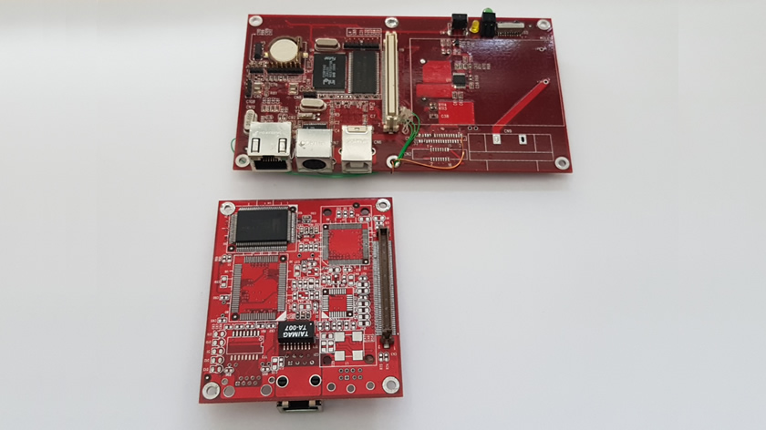
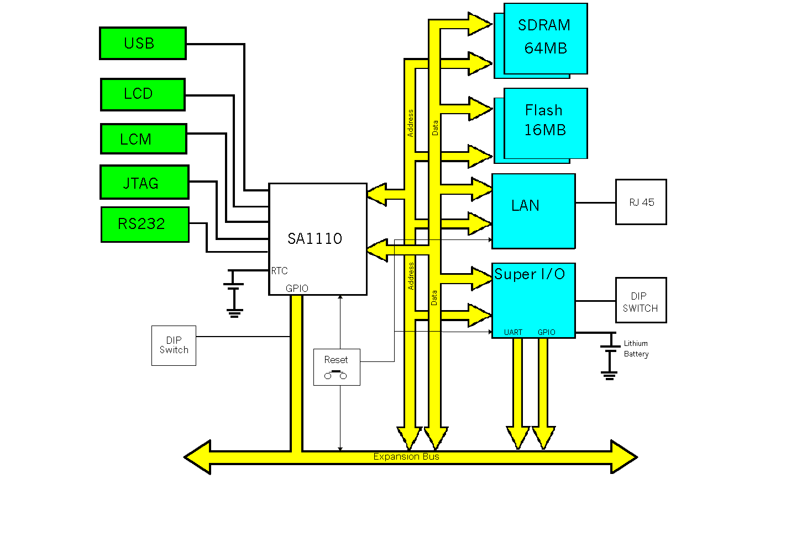
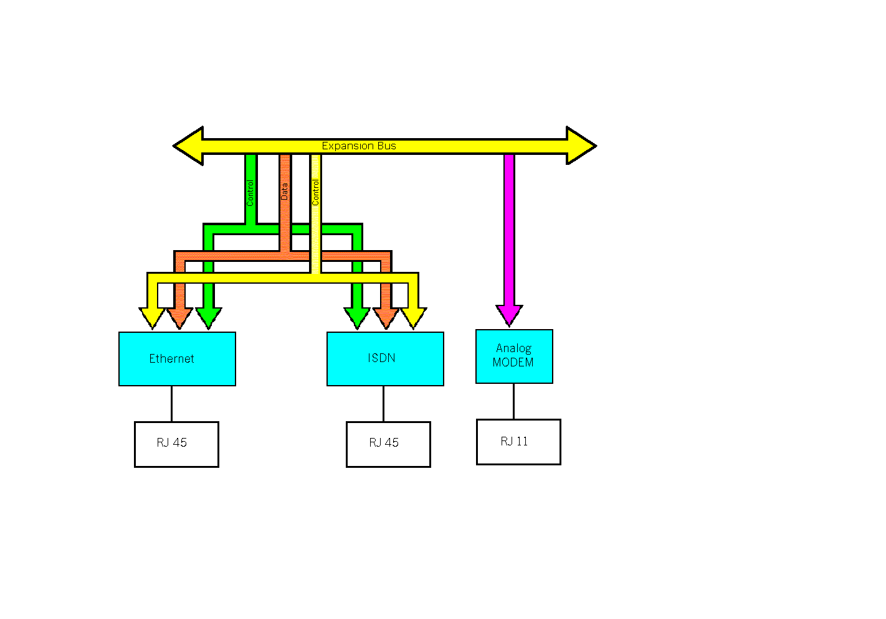
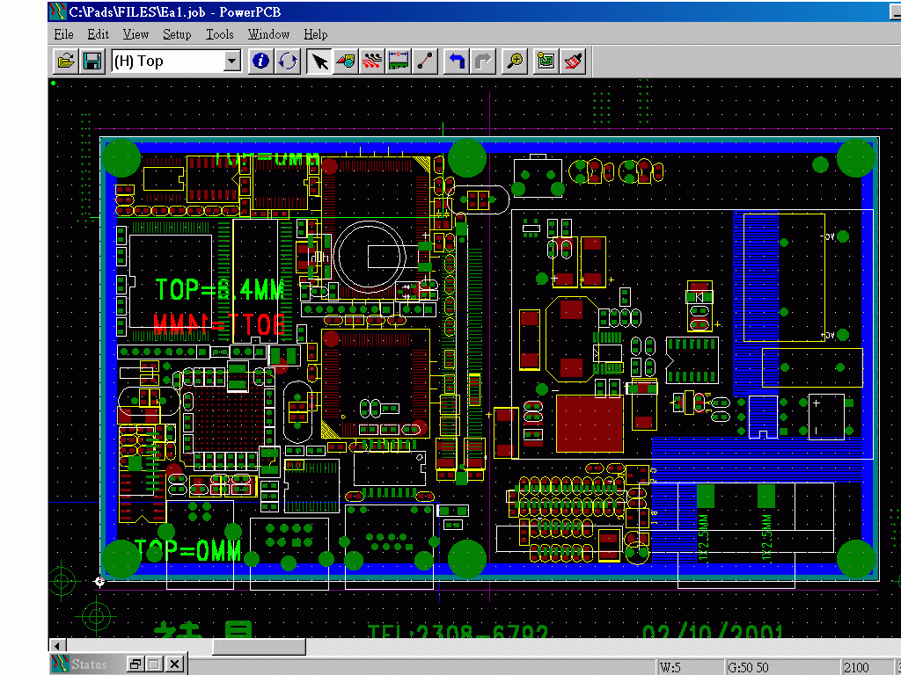
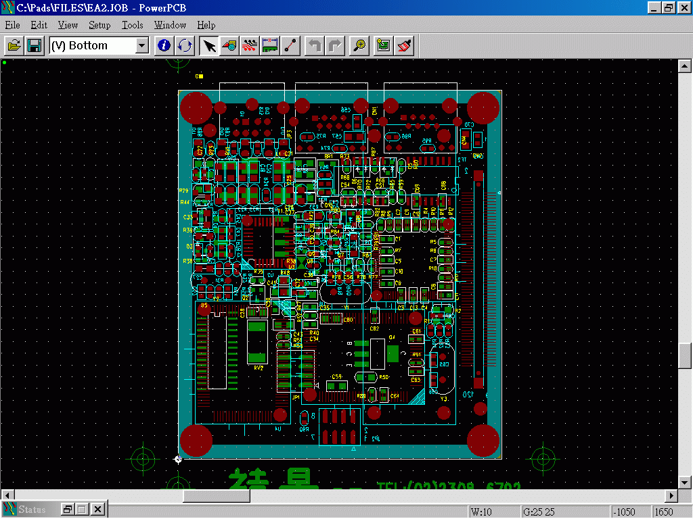

\[Click on the image to view it in a higher resolution\]  
[](media/cerberus-hcc-2001.jpg)
\[Cerberus as it was presented at the 2001 edition of the HCC fair\]

# cerberus

### Welcome to the Wonderful World of single board computing

With 2001 technology, it could have been the first smartphone ...

## Specifications

```
PCB1 Hardware specification

*****************************************************************************

Name : Cerberus_001

Introduction :
    Cerberus001 is a gerneral purpose network control card which the size is
 very small for mobil use. On board processor is Intel StrongARM SA1110 206M
 Hz with 64 MB SDRAM and 16MB flash. One 10base ethernet controller is
 equipped on board for network. The control card can receive or transmit the
 console data from on board UART and USB. On board LCM and LCD connectors are
 provided for numeric and graphic display. And one IrDA port is provided for
 wireless control. A general purpose I/O controller is also equipped on board
 for system RTC, this controller also provides many general purpose I/Os and
 one full-duplex UART for the on board expansion bus. Cerberus_001 takes AC
 110V to 220V as the power input.

Features :

   Board size   : 140x80mm
   CPU          : Intel StrongARM 206MHz
   Memory       : 64MB SDRAM, 16MB Flash

   Ethernet     : Ethernet 10M Base x 1
   UART         : RS-232 data transfer up to 230 Kbps
   USB          : Endpoints operating at 12 Mbps, half duplex
   LCM output   : Support LCM display.
   LCD output   : Supports up to 256 colors display.
   IrDA         : Support HPSIR up to 1152K transfer rate
   RTC          : Data retented by Lithium battery.

   Expension bus: For extendible daughter board.

   Power input       : 100-220V AC input.

*****************************************************************************
Details : 


Main components : 
 CPU       : Intel SA1110 206MHz (version BD or BE)
 Memory    : Samsung 64MB (32 bit data bus, expandable to 128MB)
 Flash     : Intel Strata Flash 16MB (32 bit data bus, expandable to 64MB)
 Ethernet  : CS8900A network controller (10-Base).
 Super I/O : Winbond W83977AF.
 AC-DC     : Gerneral purpose AD-DC converter (in AC 220-110V/out DC 5V)

Connectors :
 Ethernet I/O        : AMP RJ45 x 1 (with 2 LEDs)
        * details    : Ethernet output (Embedded in CS8900A)
                       Support 10Base Ethernet

 RS232 / SDLC (DCE)  : AMP 8 pin Mini DIN x1
        * details    : Embedded in SA1110
                       Supports high-speed data transfer up to 230 Kbps

 USB I/O             : AMP USB-B type x1
        * details    : Embedded in SA1110
                       Supports endpoints operating at 12 Mbps, half duplex

 JTAG control        : 8 pin connector (compatible with Yorkie) x1
        * details    : Support IEEE 1149.1 JTAG boundary scan

 Expansion local bus : Molex board to board connector x1
        * details    : Support 120 pins board to board connection.

 AC input            : AC power inlet x1
        * details    : Support 100-220V AC input.

 LCM output          : Molex 16p Vertical, ZIF Receptacle
        * details    : Embedded in SA1110.
                       Support LCM display.

 LCD output          : Molex 32p Vertical, ZIF Receptacle
        * details    : Embedded in SA1110
                       Supports up to 256 colors display.
   P.S. Since LCM and LCD will not work in the same time. They will share
        the same TR!! Trim the TR for LCM for low-end device. Trim TR for
        LCD for high-end device.

LEDs :
 Power indicator : x1 , green
        * details: Power good indicator.

 System Ready    : x1 , yellow
        * details: System ready indicator, generated by software(SA1110,GPIO).

 Ethernet LEDs   : Lan x 1, Link x 1 (on RJ45 connector)
        * details: generated by ethernet controller on CS8900A.

Misc :
 IrDA             : x1
        * details : Embedded in SA1110, on board transceiver.
 Reset buttom     : x1
        * details : Small push bottom, reset processor and all peripherals.
 2-bit DIP switch : x1
        * details : Configurable hardware input. Connected to SIO GPIO.
 Real Time Clock  : x1
        * details : Embedded in Winbond 83977F
                    Data retention by Lithium battery, 10 yrs.
```

```
PCB2 Hardware specification

*************************************************************************

Name : Cerberus_002

Introduction :
    Cerberus002 is a versatile network input module for Cerverus001 which
 contains 1 ethernet, 1 ISDN and 1 analog Modem network input.

Features :

   Board size   : 70x80mm
   Ethernet     : Ethernet 10M Base x 1
   ISDN         : Support 2 ISDN B channel and 1 ISDN D channel, support
                  S/T interface.
   Analog Modem : Support 56K analog Modem, with software configurable
                  SmartDAA.
   Expension bus: For Cerberus001 and compatible control board.

*************************************************************************
Details :

Main Components :
  LAN    : CS8900A
  Modem  : Conexant SmartSCM + SmartDAA (without extra memory)
  ISDN   : Cologne HFC-SP ISDN controller (without extra memory)

Connectors  :
  LAN       : AMP RJ45 x1  (with LEDs) shield
    *details: LAN 10Base 

  ISDN      : AMP RJ45 x1  (without LEDs) shield
    *details: ISDN 

  Modem     : AMP RJ11 x1 shield
    *details: Modem

  Expansion Local Bus : Molex board-to-board connector.
    *details: Connected to PCB1 

LEDs :
  Modem : x3 (as original design)
  ISDN  : x2 (as original design, on RJ45 )
  LAN   : x2 (as original design)
```

## Photo shoot



Cerberus with an LCD in jewel casing as it was presented at the 2001 edition of the CeBit Hanover.
Sadly, the photo is low resolution and the only one existing.

\[Click on the image to view it in a higher resolution\]  
[](media/lcd-jewelcase-1449x923.jpg)

Left: Cerberus in jewel case  
Center: the revolutionary Toshiba LTM04C380K with 640x480 display.  
Right: Samsung galaxy S9 as comparison.  
Datasheet: [media/LTM04C380Kv10.pdf](media/LTM04C380Kv10.pdf)

\[Click on the image to view it in a higher resolution\]  
[](media/daughter-1074x1000.jpg)

Displaying the main/daughter-board bus connector.  
The mainboard contains all the digital components, the extended board the function specific components.  
There were design plans to use radio components making it one of the first smart phones.

 

Functional diagrams of the main board, and daughter-board at the HCC/Cebit.

 

PCB overview for both boards.

## Versioning

This project adheres to [Semantic Versioning](http://semver.org/spec/v2.0.0.html).
For the versions available, see the [tags on this repository](https://github.com/xyzzy/cerberus/tags).

## License

This project is licensed under the GNU General Public License v3 - see the [LICENSE.txt](LICENSE.txt) file for details
